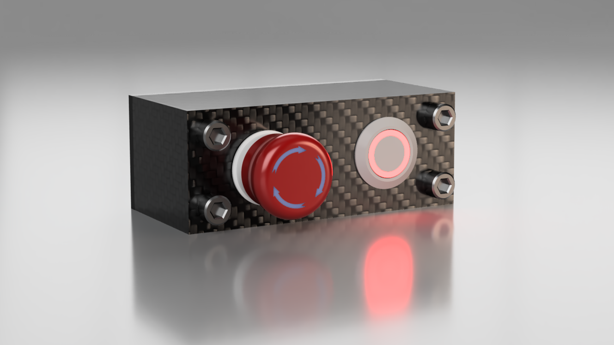
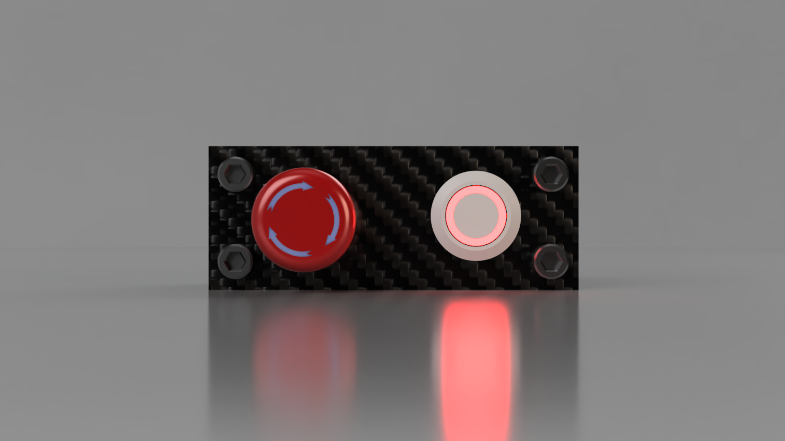
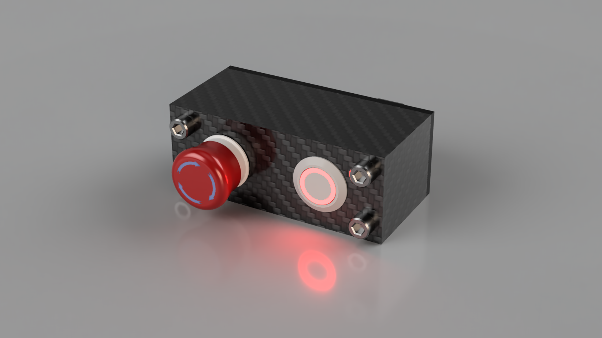
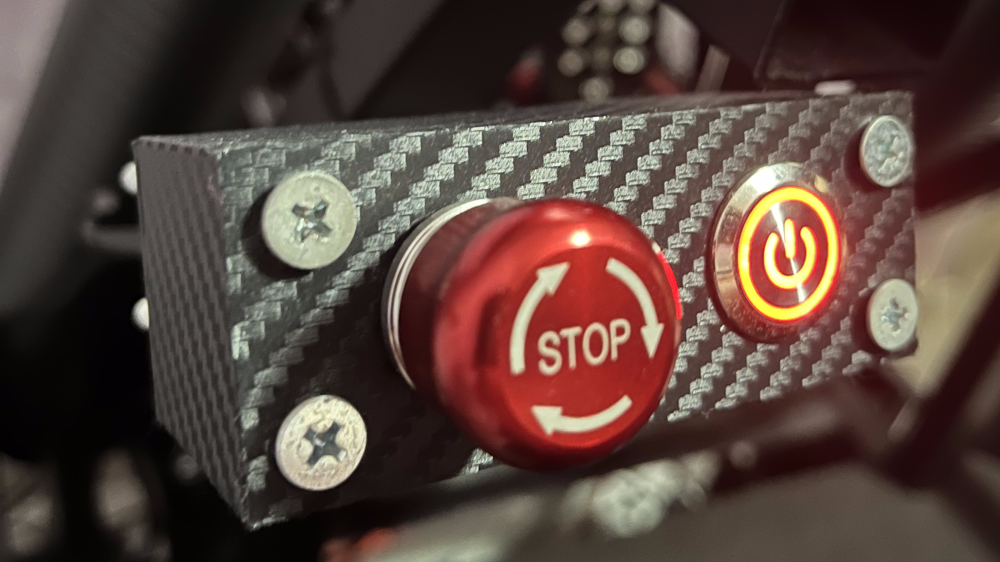
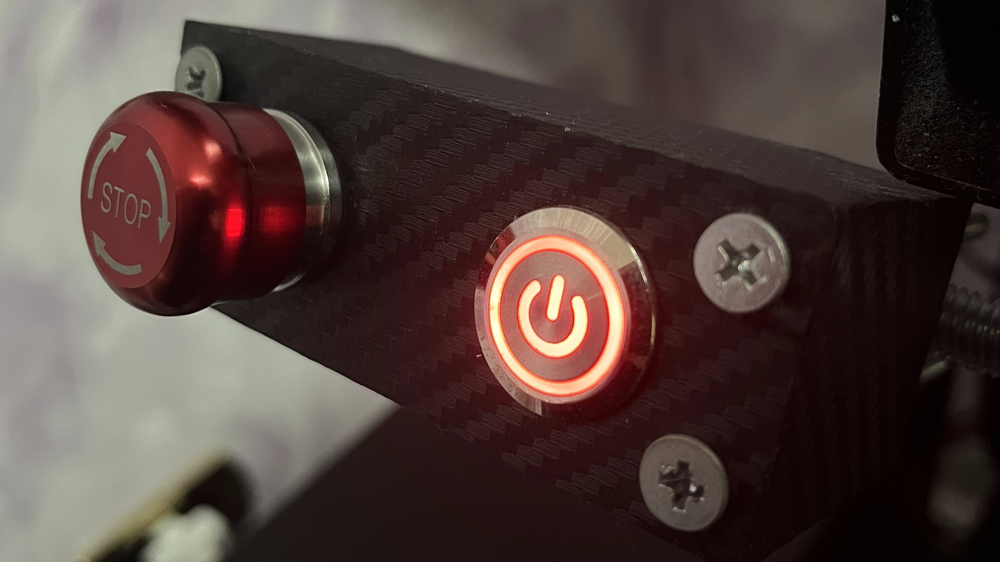

# **FANATEC™ PODIUM KILL-SWITCH REPLICA** 🚨 

**Tags:**

&nbsp;&nbsp;&nbsp;&nbsp;&nbsp;&nbsp;&nbsp;&nbsp;&nbsp;

---

## **PROJECT DESCRIPTION:**

This project is a **DIY hardware project** and it's a replica of the *FANATEC™ PODIUM KILL-SWITCH*.

The *purpose* of this project is to create a perfect replica of the *FANATEC™* product, with **the exact same features** but a much *cheaper price*.

Thanks to this box, It's possible to *turn ON* and *OFF* the DD1 / DD2 base **comfortably**.

Furthermore, with the *emergency button*, the power supply can be **switched off immediately** in case of **danger**.

This DIY project is **way cheaper** than the official one.

Also, *no line of code or an arduino* is needed, because the DD1 / DD2 (ECU) manages everything automatically.

  

### **Features**
- **Comfortably and remotely** turn ON / OFF your Fanatec™ DD1 / DD2, *without having to reach* the button at the **rear** of the wheelbase.
- **Instantly turn OFF** the power using the **emergency button** in case of problems with the Wheel Base.
- Thoose are **the same Features of the Official "Podium Kill Switch" by Fanatec™.**

## **Ratings**

**Difficulty:** &nbsp;&nbsp;&nbsp;&nbsp;&nbsp;&nbsp;&nbsp;&nbsp;&nbsp;&nbsp;&nbsp;&nbsp;&nbsp; 1/5  ⭐⚫⚫⚫⚫

**Parts needed:** &nbsp;&nbsp;&nbsp;&nbsp;&nbsp;&nbsp; 2/5  ⭐⭐⚫⚫⚫

**Cost:** &nbsp;&nbsp;&nbsp;&nbsp;&nbsp;&nbsp;&nbsp;&nbsp;&nbsp;&nbsp;&nbsp;&nbsp;&nbsp;&nbsp;&nbsp;&nbsp;&nbsp;&nbsp;&nbsp;&nbsp; 2/5  ⭐⭐⚫⚫⚫

**Usefulness:** &nbsp;&nbsp;&nbsp;&nbsp;&nbsp;&nbsp;&nbsp;&nbsp;&nbsp;&nbsp; 3/5  ⭐⭐⭐⚫⚫

**Time needed:** &nbsp;&nbsp;&nbsp;&nbsp;&nbsp;&nbsp; 2/5  ⭐⚫⚫⚫⚫

---

## **3D MODELS IMAGES** 

### **CASE:**

  
  

### **BACK:**

  
  

---

### **3D MODEL FILES:**

**All** 3D models files are **available for free** and *can be found in the repository.*

[//]: # (Do you want to have it printed? Click Here.)

## **Wiring diagram** 

  

**Hardware components:**
- 1 x **Momentary** Button. 19mm.  *(Led is Optional)*
- 1 x **Emergency Button** Switch. 19mm.
- 1 x **RJ11 6P6C Connector** Breakout Board Module. (PCB) *(Optional)*
- 1 x Cable with **both** *RJ12 (6P6C)* end type.
- 1 x 3D Printed Case *(Optional)*
- 4 x M5 Screws 50mm
- 4 x M5 Nuts

**Necessary tools:**
- Soldering Iron
- 3D Printer 

### **How to assemble it** (WITH RJ11 6P6C Connector Module)

1. Screw the Buttons Inside the **3D printed Case**.
2. Wire the PCB pins with the buttons and the led **according to the Wiring Diagram**.
3. Close the 3D printed Case.
4. *Connect the cable* to the end of the Board and to the DD1 / DD2 WheelBase.
5. Place the case in a *comfortable place* and **start using it**.

### **How to assemble it** (WITHOUT RJ11 6P6C Connector Module)

1. Open and **strip the wires** of the RJ12 (6P6C) cable.
2. Screw the Buttons Inside the 3D printed Case.
3. Wire the **stripped cables** with the buttons and the led **according to the Wiring Diagram**.
3. Close the 3D printed Case.
4. *Connect the cable* to the DD1 / DD2 WheelBase.
5. Place the case in a *comfortable place* and **start using it**.

---

## **GALLERY:**

### **RENDERS**

  
  

  

## **IRL (Project Completed)**

  
  

