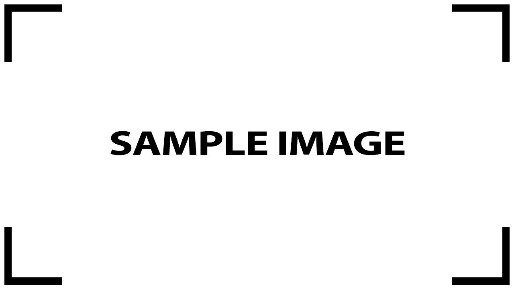

# **PROJECT TITLE** 🚧    

Tags: (https://shields.io/)

---

## **PROJECT DESCRIPTION:**

[Text Description]

Year / quarter / month / period (Optional)

  

### **Features**
- 
- 
- 

## **Ratings**

**Difficulty:** &nbsp;&nbsp;&nbsp;&nbsp;&nbsp;&nbsp;&nbsp;&nbsp;&nbsp;&nbsp;&nbsp;&nbsp;&nbsp; 5/5  ⭐⭐⭐⭐⭐

**Parts needed:** &nbsp;&nbsp;&nbsp;&nbsp;&nbsp;&nbsp; 3/5  ⭐⭐⭐⚫⚫

**Cost:** &nbsp;&nbsp;&nbsp;&nbsp;&nbsp;&nbsp;&nbsp;&nbsp;&nbsp;&nbsp;&nbsp;&nbsp;&nbsp;&nbsp;&nbsp;&nbsp;&nbsp;&nbsp;&nbsp;&nbsp; 5/5  ⭐⭐⭐⭐⭐

**Usefulness:** &nbsp;&nbsp;&nbsp;&nbsp;&nbsp;&nbsp;&nbsp;&nbsp;&nbsp;&nbsp; 1/5  ⭐⚫⚫⚫⚫

**Time needed:** &nbsp;&nbsp;&nbsp;&nbsp;&nbsp;&nbsp; 5/5  ⭐⭐⭐⭐⭐

## **REPORT** (?)

Check the report in the repository if avaiable.

---

## **3D MODELS IMAGES** (if necessary)

  

(One or two images that contains multiple view of one or many 3D models)

(Do you want to have it printed? Click Here.)

## **Wiring diagram** (if necessary)

  

**Hardware components:**
- 1 x Arduino
- 5 x 220Ohm Resistor 
- ecc

**Necessary tools:**
- Soldering Iron
- 3D Printer 
- ecc

### **How to assemble it**

1. Phase 1
2. Phase 2
3. Phase 3
4. Phase 4
5. Phase 5
6. ecc

---

## **GALLERY:**

### **RENDER**

  

## **IRL (Project Completed)**

  

